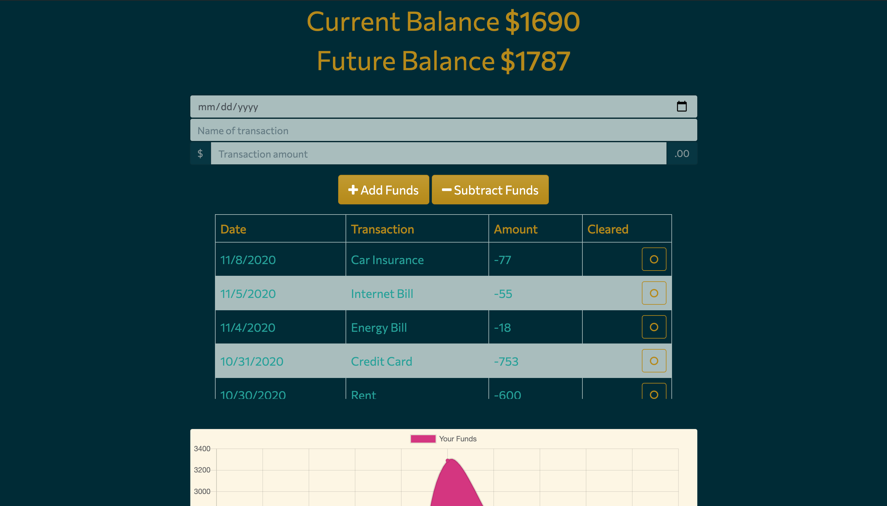

# Welcome to Budget Tracker! 0.1.0

## Description

Balance your accounts and track your expenses even when offline. See your current balance and calculate your future balance based on your upcoming expenses. This application will fully work and save your data with no internet access. 

Technologies used
* Node.js
* Express
* Chart.js
* MongoDB with Mongoose Schema
* IndexDB
* Web Manifest
* Service Worker

Deployed Application: [https://budget-tracker-kassimariemc.herokuapp.com/](https://budget-tracker-kassimariemc.herokuapp.com/)

## License

Copyright &#169; 2020 [@kassimariemc](https://github.com/kassimariemc). 
This project is [MIT](https://choosealicense.com/licenses/mit/) licensed.

_____________________________________________________
> *This README was generated with &hearts; by [readme-generator](https://github.com/kassimariemc/README-generator)*

